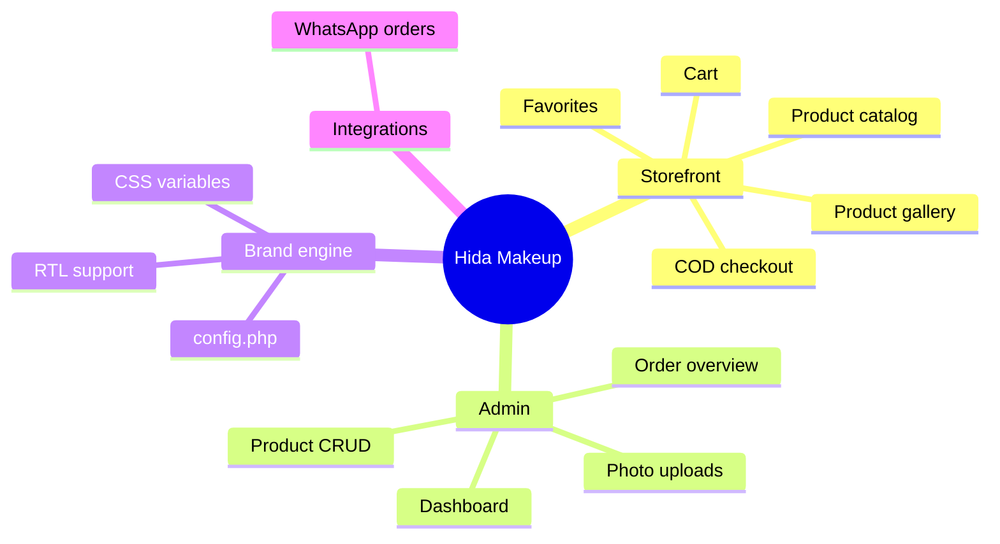
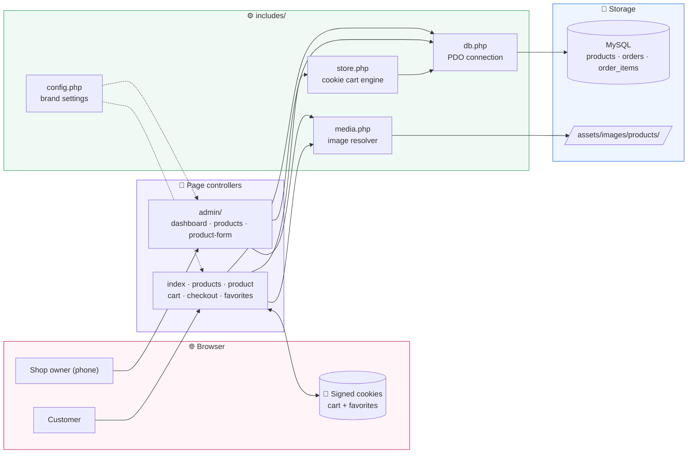
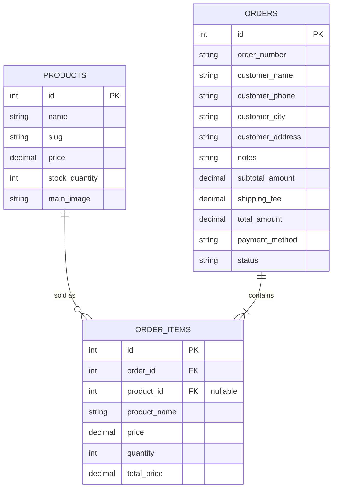
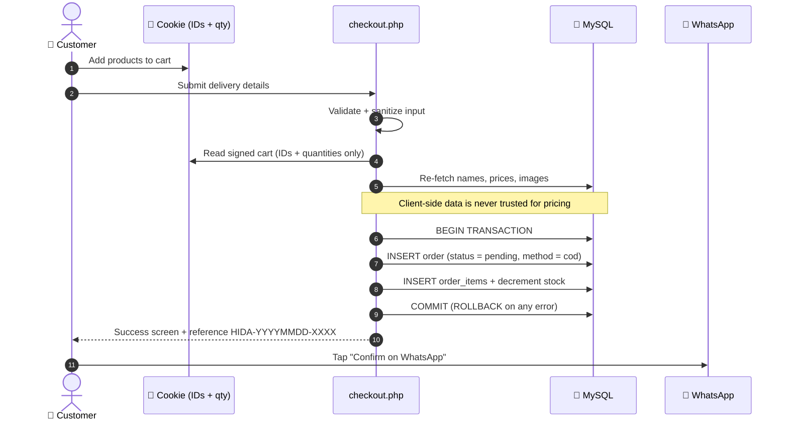
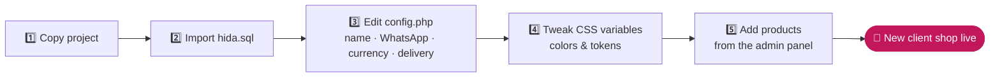
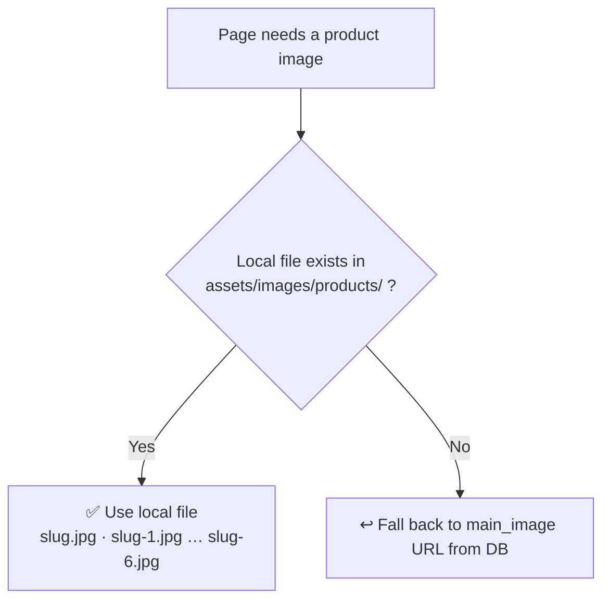

<div align="center">


### 💄 A secure, white-label online store built for the Moroccan market

**Cash on Delivery** · **WhatsApp order confirmation** · **Mobile-first admin panel** · **Rebrand in minutes**

<br/>


-informational?style=flat-square)


<br/>

[✨ Features](#-features) ·
[🏗️ Architecture](#%EF%B8%8F-architecture) ·
[🔐 Security](#-security-by-design) ·
[🧠 What it demonstrates](#-what-this-project-demonstrates) ·
[🚀 Quick start](#-quick-start) ·
[📬 Contact](#-contact)

</div>

---

## 👋 TL;DR

> **Hida Makeup** is a complete online cosmetics shop written in **framework-free PHP 8 and MySQL**. Customers browse, favorite, and order without creating an account, pay **cash on delivery**, and confirm through **WhatsApp**. The shop owner manages products and orders from a **phone-first admin panel**.
>
> It was engineered around one idea: **build once, rebrand for any client.** Every brand setting lives in one config file and one CSS file.

<table>
<tr>
<td align="center" width="25%"><h3>🛒</h3><b>Guest checkout</b><br/><sub>No account needed</sub></td>
<td align="center" width="25%"><h3>💵</h3><b>Cash on delivery</b><br/><sub>Tailored to Morocco</sub></td>
<td align="center" width="25%"><h3>💬</h3><b>WhatsApp confirm</b><br/><sub>One-tap order handoff</sub></td>
<td align="center" width="25%"><h3>📱</h3><b>Mobile admin</b><br/><sub>Manage from your phone</sub></td>
</tr>
</table>

---

## ✨ Features

<table>
<tr>
<td width="50%" valign="top">

### 🛍️ Storefront
- 🏠 Home, product listing and product detail pages
- 🖼️ Product image galleries (main image + up to 6 photos)
- 🛒 Cart and ❤️ Favorites with **no login required**
- 🚚 Automatic shipping fee, with free-delivery support
- 🧾 Auto-generated order references, e.g. `HIDA-20260921-A1B2`
- 💬 WhatsApp confirmation button on the order success screen
- 🌍 Responsive layout and an **RTL stylesheet** ready for Arabic

</td>
<td width="50%" valign="top">

### 🛠️ Admin panel
- 📊 Dashboard with stats, quick actions and recent orders
- 🔎 Searchable product list
- ➕ Create and edit products with photo slots
- 📲 **Phone layout:** stat cards, 44px tap targets, fixed bottom tab bar
- 🖥️ **Desktop layout:** top nav and real data tables
- 🔁 Renaming a product moves its photos to the new slug
- 🗑️ Deleting a product cleans up its photos and keeps past orders intact

</td>
</tr>
</table>



---

## 🏗️ Architecture

A deliberately simple, layered structure: page controllers on top, shared logic in `includes/`, MySQL underneath. No framework, no build step, no Composer required.



### 🗃️ Data model



> 📝 `order_items` stores a **snapshot** of the product name and price at purchase time, and `product_id` becomes `NULL` if a product is deleted. Order history stays accurate forever.

### 🔄 Checkout flow



---

## 🔐 Security by design

Security is treated as a core feature, not an afterthought.

| | Protection | How it works |
|:-:|---|---|
| 🛡️ | **SQL injection** | Every query uses **PDO prepared statements** |
| 🍪 | **Cookie tampering** | Cart and favorites are **signed cookies** that contain only product IDs and quantities |
| 💰 | **Price manipulation** | Names, images and prices are **always re-read from MySQL**, so a modified cookie can't change what a customer pays |
| ⚛️ | **Data integrity** | Orders are written in a **database transaction** with rollback on failure |
| 📦 | **Stock safety** | Stock is decremented with `GREATEST(0, stock - qty)`, so it never goes negative |
| 🧼 | **XSS** | Output is escaped with `htmlspecialchars` and inputs are sanitized |
| 🖼️ | **Upload rules** | JPG/PNG/WebP/GIF only, 3 MB max, 200×200 px minimum |
| ✅ | **Server-side validation** | Name, phone (at least 9 digits), city and address are all validated |

<details>
<summary><b>🔎 Code peek: transactional order creation</b></summary>

```php
$pdo->beginTransaction();
try {
    // 1. Insert the order
    $stmt = $pdo->prepare("INSERT INTO orders (...) VALUES (...)");
    $stmt->execute([...]);
    $order_id = $pdo->lastInsertId();

    // 2. Insert line items and decrement stock, priced from the DB
    foreach ($cart_items as $item) {
        $item_stmt->execute([...]);
        $stock_stmt->execute([':qty' => $item['quantity'], ':id' => $item['id']]);
    }

    $pdo->commit();
    cart_clear();
} catch (Exception $e) {
    $pdo->rollBack();   // nothing is half-saved
}
```

</details>

---

## 🧠 What this project demonstrates

For recruiters and engineers reviewing this repo:

| Skill | Evidence in the codebase |
|---|---|
| **Backend engineering** | Framework-free PHP 8 organized into page controllers and shared modules |
| **Database design** | Relational schema, foreign keys, order snapshots, transactional writes |
| **Application security** | Prepared statements, signed cookies, server-side price authority, output escaping |
| **Product thinking** | Guest checkout, COD and WhatsApp confirmation designed around real local buying habits |
| **Responsive / mobile-first UI** | Phone-first admin CSS, tap-sized controls, bottom tab bar, RTL support |
| **Maintainability** | Centralized config, CSS design tokens, single image-resolution helper |
| **Scalability of the business model** | White-label design: one codebase, many clients |

---

## 🧰 Tech stack

<div align="center">


</div>

| Layer | Technology |
|---|---|
| **Backend** | PHP 8+ (pure, no framework) |
| **Database** | MySQL via PDO |
| **Frontend** | HTML5, CSS3 with custom properties, vanilla JavaScript |
| **Icons** | Font Awesome |
| **State** | Signed cookies for cart and favorites, PHP sessions for flash notices only |
| **Local dev** | XAMPP |

---

## 📁 Project structure

```
Hida-Makeup/
├── 📂 admin/                  # Mobile-first back office
│   ├── _layout.php            #   shell, navigation, admin_*() helpers
│   ├── index.php              #   dashboard: stats, quick actions, orders
│   ├── products.php           #   searchable product list
│   └── product-form.php       #   create / edit product + photo slots
├── 📂 assets/
│   ├── css/                   #   style · responsive · rtl · admin
│   ├── js/main.js
│   └── images/products/       #   photos named after product slug
├── 📂 database/
│   └── hida.sql               # schema + seed data
├── 📂 includes/
│   ├── config.php             # ⭐ brand & business settings
│   ├── db.php                 #   PDO connection
│   ├── store.php              #   signed-cookie cart & favorites
│   ├── media.php              #   product image resolver & uploads
│   ├── header.php
│   └── footer.php
├── index.php                  # home
├── products.php               # catalog
├── product.php                # product detail
├── cart.php                   # cart
├── checkout.php               # COD checkout + WhatsApp handoff
├── favorites.php              # wishlist
└── GEMINI.md                  # project conventions
```

---

## 🚀 Quick start

### Prerequisites


### 1️⃣ Clone into your web root

```bash
# XAMPP on Windows: C:\xampp\htdocs\
git clone https://github.com/kuriboh23/Hida-Makeup.git
cd Hida-Makeup
```

### 2️⃣ Create the database

Start **Apache** and **MySQL**, then either import `database/hida.sql` through [phpMyAdmin](http://localhost/phpmyadmin) or run:

```bash
mysql -u root -p -e "CREATE DATABASE hida CHARACTER SET utf8mb4 COLLATE utf8mb4_unicode_ci;"
mysql -u root -p hida < database/hida.sql
```

### 3️⃣ Configure

Edit `includes/config.php` with your database credentials and brand settings.

### 4️⃣ Open it

| | URL |
|---|---|
| 🛍️ Storefront | `http://localhost/Hida-Makeup/` |
| 🛠️ Admin | `http://localhost/Hida-Makeup/admin/` |

---

## 🎨 White-label in 5 steps



**Brand settings (`includes/config.php`):** site name · WhatsApp number · phone · currency · delivery fee · social links

**Design tokens (`assets/css/style.css`):**

```css
:root {
  --burgundy: /* primary brand color */;
  --green:    /* success / free shipping */;
  --muted:    /* secondary text */;
}
```

---

## 🖼️ Product photo system



- A **local file always wins** over the URL stored in the database
- Name files after the product slug (`<slug>.jpg`, `<slug>-1.jpg` … `<slug>-6.jpg`) or its ID (`8.jpg`)
- Drop files in by hand or upload them from `admin/product-form.php`
- Pages always render images through `product_image_url()` and `product_gallery_urls()`, never `main_image` directly

---

## 📸 Screenshots

<!-- Add your screenshots to a /docs/screenshots folder, then uncomment:

<div align="center">
  
  
  
</div>

-->

*Screenshots coming soon.*

---

## 🗺️ Roadmap

- [x] Catalog, cart, favorites and COD checkout
- [x] WhatsApp order confirmation
- [x] Mobile-first admin panel with photo uploads
- [x] Signed-cookie cart with server-side pricing
- [ ] 🌍 Arabic language switch (RTL stylesheet already included)
- [ ] 🗂️ Categories and product filters
- [ ] 🔑 Admin authentication and roles
- [ ] 📧 Order status updates and email notifications
- [ ] 💳 Online payment gateway
- [ ] 🏷️ Discount codes

---

## 🚢 Production checklist

- [ ] Change database credentials and the cookie-signing secret
- [ ] Protect `/admin` (authentication, HTTP auth or IP allow-list)
- [ ] Serve over **HTTPS**
- [ ] Set `display_errors = Off`
- [ ] Restrict `assets/images/products/` to image files only
- [ ] Keep real credentials out of version control

---

## 🤝 Contributing

Contributions and ideas are welcome.

```bash
git checkout -b feature/amazing-feature
git commit -m "Add amazing feature"
git push origin feature/amazing-feature
```

Then open a Pull Request. Conventions: **prepared statements only**, simple and maintainable code, everything dynamic.

---

## 📬 Contact

<div align="center">

**Built by [kuriboh23](https://github.com/kuriboh23)**

[](https://github.com/kuriboh23)
[](https://www.linkedin.com/in/hamza-boussalham/)
[](mailto:hamzaboussalham8@gmail.com)

<sub>Open to opportunities · Feedback and code reviews welcome</sub>

⭐ **If you like this project, drop a star!** ⭐


</div>
